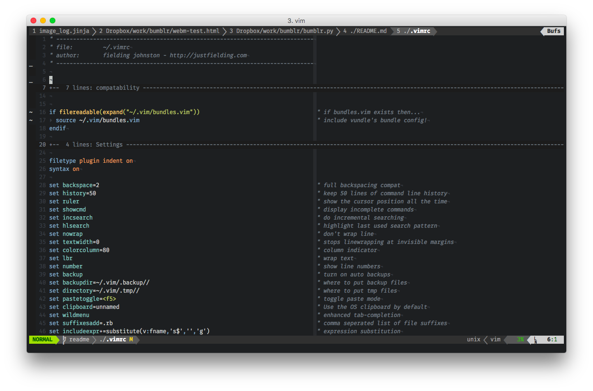

# dotfiles

## Table of Contents
- overview
- installation
- extended info abotu each package (what to call this?)
- todo
- inspiration and special thanks

## Overview
TODO: update this section to include a brief overview of what my settings/additions include
```
bash        > bash settings, aliases, functions, 
bin         > scripts
dircolors   > 
git         > global git config and aliases
grc         > 
iterm2      > 
readline    >
terminfo    > 
tmux        > 
vim         > 
.osx        >
```

## Installation

```sh
brew install stow

stow bash bin discolors git grc iterm2 deadline terminfo tmux vim

git submodule update --init --recursive

tic ~/.termino/69/iterm.terminfo
tic ~/.terminfo/74/tmux.terminfo
tic ~/.terminfo/74/tmux-256color.terminfo

vim +BundleInstall +BundleClean +q

~/.tmux/plugins/tpm/bin/install_plugins
```

## Bash


## VIM



### Plugins

#### Feature Plugins

[bronson/vim-trailing-whitespace](https://github.com/bronson/vim-trailing-whitespace)  
[nathanaelkane/vim-indent-guides](https://github.com/nathanaelkane/vim-indent-guides)  
[tpope/vim-afterimage](https://github.com/tpope/vim-afterimage)  
[scrooloose/syntastic](https://github.com/scrooloose/syntastic)  
[scrooloose/nerdtree](https://github.com/scrooloose/nerdtree)  
[terryma/vim-multiple-cursors](https://github.com/terryma/vim-multiple-cursors)  
[kien/ctrlp.vim](https://github.com/kien/ctrlp.vim)  
[ryanss/vim-hackernews](https://github.com/ryanss/vim-hackernews)  
[fs111/pydoc.vim](https://github.com/fs111/pydoc.vim)  

[christoomey/vim-tmux-navigator](https://github.com/christoomey/vim-tmux-navigator)  
[sjl/vitality.vim](https://github.com/sjl/vitality.vim)  
[shime/vim-livedown](https://github.com/shime/vim-livedown)  
[mrtazz/simplenote.vim](https://github.com/mrtazz/simplenote.vim)  
[junegunn/goyo.vim](https://github.com/junegunn/goyo.vim)  
[moll/vim-bbye](https://github.com/moll/vim-bbye)  
[tomtom/tcomment_vim](https://github.com/tomtom/tcomment_vim)  

#### Syntax Highlighting, Linting and Language Specific Plugins

[davidhalter/jedi-vim](https://github.com/davidhalter/jedi-vim)  
[tpope/vim-haml](https://github.com/tpope/vim-haml)  
[plasticboy/vim-markdown](https://github.com/plasticboy/vim-markdown)  
[lambdatoast/elm.vim](https://github.com/lambdatoast/elm.vim)  
[leshill/vim-json](https://github.com/leshill/vim-json)  
[kchmck/vim-coffee-script](https://github.com/kchmck/vim-coffee-script)  
[ajford/vimkivy](https://github.com/ajford/vimkivy)  
[tshirtman/vim-cython](https://github.com/tshirtman/vim-cython)  
[airblade/vim-gitgutter.git](https://github.com/airblade/vim-gitgutter.git)  

#### Color Plugins

[godlygeek/csapprox](https://github.com/godlygeek/csapprox)  

##### Current Color Scheme

[w0ng/vim-hybrid](https://github.com/w0ng/vim-hybrid)  

##### Other Color Schemes

[morhetz/gruvbox](https://github.com/morhetz/gruvbox)  
[tomasr/molokai](https://github.com/tomasr/molokai)  
[adlawson/vim-sorcerer](https://github.com/adlawson/vim-sorcerer)  
[sickill/vim-monokai](https://github.com/sickill/vim-monokai)  
[chriskempson/vim-tomorrow-theme](https://github.com/chriskempson/vim-tomorrow-theme)  
[Junza/Spink](https://github.com/Junza/Spink)  

## Tmux

## README Maintenance

vim search and replace to convert bundles.vim to markdown hyperlinks for plugin
section.

```
  %s/[\(.*\)](https://github.com/\(.*\))  /[\1](https:\/\/github.com\/\1)  /
```

## TODO

- [x] binds/tune up text/code folding within vim (temp marking as done, I think I am content with za, zo, zc, and their bigcase counterparts)
- [x] Rework implementation/installation at new workstation; current .gitignore with the git repo existing in ~ is pretty bogus
- [x] check in to submodules for tmux/vim/whatev plugins
- [x] Tmux configuration (basically a default config currently)
- [ ] where the hell should I put .colors/fielding? XResources?
- [ ] write up on using GNU Stow and what each stow package is for, etc
- [ ] find a suitable vim binding for Goyo and Goyo!
- [ ] check in to vim-hackernews and adding additional color highlighting to
 comments pages. A small dab of color could go a long way
- [ ] can I get Github Flavored Markdown for livedown/vim-livedown?
- [ ] Revise Vim plugins; Try and incorporate desired, but currently unsed
plugins, in to my workflow, and then remove any "unfitting" or not needed.
- [ ] Tmux scrolling with less
- [ ] Clipboard "functionality" and sanity with vim/tmux and os x
- [ ] AN OPTIMISTIC ADVENTURE DOWN POSTAL LANE: MUTT the ultimate setup.
  - [ ] MUTT
  - [ ] notmuch
  - [ ] msmtp
  - [ ] POSSIBLY offlineimap
  - [ ] contacts (brew install contacts)
- [ ] License/consider if needed
- [ ] Colors between powerline/tmux/vim seem to be off a tad bit
- [ ] .vimrc restructuring using folding and better sections
- [ ] add my weechat configuration
- [ ] submodule upkeep? (git submodule foreach git pull or git submodule foreach git pull origin master)

### Someday/Maybe
- [ ] Hotline Miami Color Scheme


## Inspiration / Special Thanks to...

* [Jeffrey Carpenter](https://github.com/i8degrees), 
his [dotfiles repository](https://github.com/i8degrees/dotfiles), and for
having somebody to "talk nerdy" to!
* [Mathias Bynens](https://mathiasbynens.be/) and his
 [dotfile repository](https://github.com/mathiasbynens/dotfiles)
