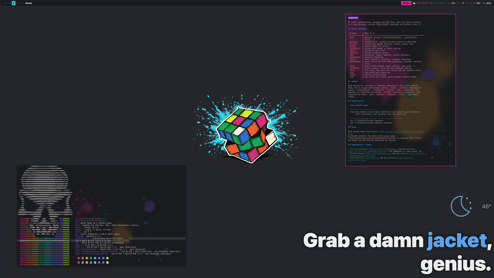

# dotfiles

My macOS configuration, managed with GNU Stow. Each top-level directory
is a stow package; running `stow <name>` symlinks its contents into `~`.



## Active packages

| Package      | What it is                                                         |
|--------------|--------------------------------------------------------------------|
| `bin`        | personal scripts (`tmux-sessionizer`, `sync-tix-to-vault`, …)      |
| `borders`    | JankyBorders — window outlines tinted by skhd mode                 |
| `claude`     | Claude Code global settings, hooks, status line                    |
| `codex`      | OpenAI Codex CLI config                                            |
| `fastfetch`  | system info banner at shell startup                                |
| `fonts`      | installed font files                                               |
| `gate`       | operator config for the gate/retro/handoff skills (vault, routing) |
| `ghostty`    | Ghostty terminal config                                            |
| `git`        | gitconfig, commit template, global gitignore                       |
| `homebrew`   | Brewfile — brew, cask, cargo, and npm package manifest             |
| `karabiner`  | keyboard remapping                                                 |
| `shell`      | shell-agnostic `.profile`, aliases, functions                      |
| `sketchybar` | macOS status bar with mode indicator, calendar, battery, clock     |
| `skhd`       | modal hotkey daemon (yabai control, tmux mode, …)                  |
| `terminfo`   | italic-capable iterm and tmux terminfo entries                     |
| `tmux`       | true-color tmux with bell alerts and per-session colors            |
| `vim`        | vim config and plugin set                                          |
| `yabai`      | tiling window manager                                              |
| `zsh`        | zsh config with zplug, purer prompt, Human++ theme                 |

## Legacy

Kept around for reference or because something on disk still expects
them, but no longer maintained: `babel`, `bash`, `chunkwm` (replaced by
yabai), `clang-format`, `dircolors`, `eslint`, `grc`, `iterm2` (replaced
by ghostty), `khd` (replaced by skhd), `mpv`, `neovim`, `readline`,
`ruby`, `spaceship`, `vint`.

## Installation

### Fresh machine

`bootstrap.sh` brings a new (or existing) Mac all the way up — idempotent,
so it's safe to re-run any time to converge a machine back to this state.

```sh
git clone https://github.com/fielding/dotfiles ~/etc && cd ~/etc
./bootstrap.sh --dry-run   # preview everything first
./bootstrap.sh             # do it
```

Phases (run a subset with `--only`/`--skip`, list with `--list`):

| Phase        | Does                                                              |
|--------------|------------------------------------------------------------------|
| `preflight`  | Xcode CLT, Rosetta, hostname, timezone                           |
| `sshkey`     | per-machine ed25519 key + agent/keychain wiring (never clobbers) |
| `homebrew`   | install Homebrew + Rust, then `brew bundle` the Brewfile         |
| `stow`       | symlink the active packages into `~`                             |
| `terminfo`   | compile the italic-capable tmux terminfo entries                 |
| `shell`      | default shell → zsh, install zplug + vim plugins                 |
| `macos`      | `defaults write` tweaks **and the Dock-clutter cleanup**         |
| `yabai`      | scripting-addition sudoers wiring (SIP stays a manual step)      |
| `agents`     | install selected LaunchAgents from `bootstrap/launchagents/`     |
| `continuity` | Handoff/Universal Control toggles + M4↔M5 one-desk checklist     |
| `mlx`        | Apple-Silicon local-model stack (`mlx-lm` via `uv`)              |

`--agents cadence,glean,weather,sync-tix-to-vault` picks which LaunchAgents
get installed (those four are the default; `ollama` is opt-in). `--no-agents`
skips them. `--yes` runs non-interactively (keeps the current hostname).

**SIP / yabai:** full scripting-addition support needs SIP partially
disabled, which can only be done from Recovery. The `yabai` phase wires up
everything else and prints the exact `csrutil disable …` command to run
there; reboot and `./bootstrap.sh --only yabai` afterward.

### Manual (stow only)

```sh
brew install stow

# Symlink the active set:
stow bin borders claude codex fastfetch fonts ghostty git homebrew \
     karabiner shell sketchybar skhd terminfo tmux vim yabai zsh

# Compile terminfo entries (italic support in tmux):
tic ~/.terminfo/74/tmux.terminfo
tic ~/.terminfo/74/tmux-256color.terminfo
```

## Theme

Most colors come from [Human++](https://github.com/justfielding/human-plus-plus),
my base24 palette. The shell-init script under
`~/src/hack/human-plus-plus/dist/shell-init.sh` is sourced from `.zshrc`
and emits the OSC palette overrides at startup.

## Inspiration / thanks

- [Jeffrey Carpenter](https://github.com/i8degrees) and his [dotfiles](https://github.com/i8degrees/dotfiles) — for somebody to "talk nerdy" to.
- [Mathias Bynens](https://mathiasbynens.be/) and his [dotfiles](https://github.com/mathiasbynens/dotfiles).
- [Xero Harrison](http://xero.nu) and his [dotfiles](https://github.com/xero/dotfiles).
